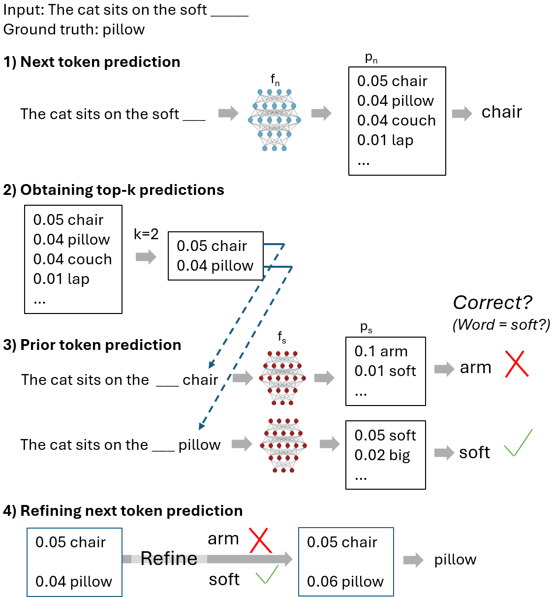

# AutoEncoder to GenerateThenRefine  
Repo for the paper *"Improving Next Tokens via Second-to-Last Predictions with Generate and Refine"* by Johannes Schneider, accepted at IDA 2025  

[Paper on arXiv](https://arxiv.org/abs/2411.15661)  

## Citation  
If you use this work, please cite its (identical) arxiv or conference version: 

@article{Schneider2025GenerateRefine,
  author    = {Johannes Schneider},
  title     = {Improving Next Tokens via Second-to-Last Predictions with Generate and Refine},
  journal   = {Intelligent Data Analysis (IDA)},
  year      = {2025} 
}

## Key idea
Train an auto-encoding model (BERT style) to predict second-to-last tokens to refine outputs of a standard autoregressive model (for next token prediction). That is, the auto-encoding model makes a prediction for each of the top-k outputs of the next-token prediction. If the prediction is correct, the likelihood of the predicted token is increased.

